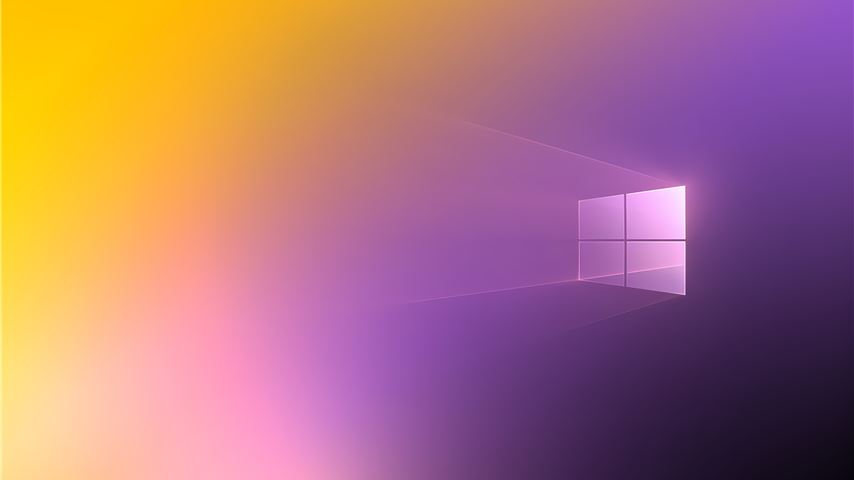

<meta property="og:image" content="https://a-moberg.com/WindowsPride2020FlagsUpscaled/example_nonbinary.jpg" />
<meta property="twitter:image" content="https://a-moberg.com/WindowsPride2020FlagsUpscaled/example_nonbinary.jpg" />

*A tiny thumbnail NOT-lossless example of these wallpapers.*

Upscaling of the wallpapers in the 'Windows Pride 2020 flags' theme to 4k. There are **18 wallpapers** in total.

### Download
[v1.0 on Github](https://github.com/AndersMoberg/WindowsPride2020FlagsUpscaled/releases/tag/v1.0)

###### Tools used
- Upscayl 2.5.5 (Digital Art)
- Windows Powertoys (downscaled to 4k)
- [PngOptimizer](https://psydk.org/pngoptimizer)

My first attempt at upscaling. The original wallpapers are really nice, but are very noisy due to the JPG artifacts. I don't pretend these are excellent results but it's fair enough, and I'm not intersted in going down the rabbit hole of what methods one should use.. what scaler / model is better / worse, what PNG optimizer to use, what image format to change to, etc.

[You can find the original Windows 10 theme here.](https://apps.microsoft.com/store/detail/9PK6DD3SHC26?hl=en-us&gl=US)

# 🌈🏳️‍🌈 Happy pride!

*I achknowledge that the original assets are owned by the Microsoft Corporation, and not by me. No rights reserved.*